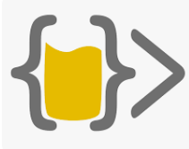

<!--
Many thanks to daniilshat for these articles which helped me to create this README =^__^=
https://habr.com/ru/post/649363/
https://habr.com/ru/post/652867/
https://arturssmirnovs.github.io/github-profile-readme-generator/
-->

<h2 align="center">Hi there, I'm Snezhana</h3> 
<h4 align="center">Experienced, reliable and self-motivated Senior Quality Assurance Lead</h4>

#### Education:
<table width="100%" border='0'>
   <tr> 
    <td width="14%" valign="middle"></td><td valign="middle">Saratov State University:  Computer Science and Information Technologies, Engineer</td></tr>
   </tr>
    <td width="14%" valign="middle"></td><td valign="middle">Stanford|Online on Coursera: Machine Learning</td></tr>
   </tr>
   <tr> 
    <td width="30%" valign="middle"></td><td valign="middle">The App Brewery: Python Coding Bootcamp</td></tr>
   </tr>
    <tr> 
    <td width="14%" valign="middle"></td><td valign="middle">QA GURU: Automated software testing with Python </td></tr>
   </tr>
  </table>

#### Statistics:

#### Skills:
<table width="100%" border='0'>
   <tr> 
    <td width="30%" valign="middle"></td><td valign="middle">Python</td></tr>
    <td width="20%" valign="middle"></td><td valign="middle">Git</td></tr>
    <td width="20%" valign="middle"></td><td valign="middle">PyCharm</td></tr>
    <td width="20%" valign="middle"></td><td valign="middle">Visual Studio Code</td></tr>
    <td width="20%" valign="middle"></td><td valign="middle">Bash</td></tr>
    <td width="20%" valign="middle"></td><td valign="middle">...</td></tr>
    </tr>
  </table>
  
<!--
#### Rebus:

</a>   
 
-->

