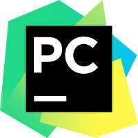

<!--
Many thanks to daniilshat for these articles which helped me to create this README =^__^=
https://habr.com/ru/post/649363/
https://habr.com/ru/post/652867/
https://arturssmirnovs.github.io/github-profile-readme-generator/
-->

<h2>Hi there, I'm Snezhana</h3>
<h3>Experienced, reliable and self-motivated Senior Quality Assurance Lead</h4>

#### Education:
<table width="100%" border='0'>
   <tr> 
    <td width="17%" valign="middle" align="middle"></td><td valign="middle">Saratov State University:  Computer Science and Information Technologies, Engineer</td></tr>
   </tr>
  </table>
  
#### Additional Education:
<table width="100%" border='0'>
   </tr>
    <td width="14%" valign="middle" align="middle"> 
   </td><td valign="middle">Stanford | Online on Coursera: Machine Learning</td></tr>
   </tr>
   <tr> 
    <td width="30%" valign="middle" align="middle"></td><td valign="middle">The App Brewery: Python Coding Bootcamp</td></tr>
   </tr>
    <tr> 
    <td width="14%" valign="middle" align="middle"></td><td valign="middle">QA GURU: Automated software testing with Python </td></tr>
   </tr>
  </table>

#### Statistics:

<!--

-->

#### Languages & Tools:

#### Connect with me:

<!--
#### Languages with labels
<code> <a>Python</a></code>
<code> <a>PyCharm</a></code>
<code> <a>Pytest</a></code>
<code> <a>Selene</a></code>
<code> <a>Selenium</a></code>
<code> <a>Requests</a></code>
<code> <a>Appium</a></code>
<code> <a>Git</a></code>
<code> <a>Allure</a></code>
<code> <a>Jenkins</a></code>
<code> <a>Bash</a></code>
<code> <a>Visual Studio Code</a></code>
<code> <a>Jira</a></code>
<code> <a>Allure TestOps</a></code>

#### Rebus =)

</a>   
 
-->
